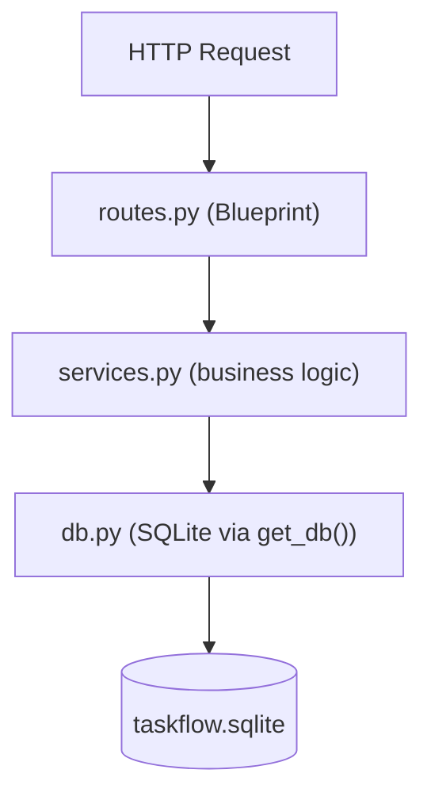

# Stage 1 - /init sent as a prompt (orientation)

- Bob task (ACP session) id: `35c95d5c3a622e9af752f54d077ba755`
- Bob: Bob 2.0.5 via `bob acp`
- Mode: `agent`
- Started (UTC): 2026-10-05T03:58:27+00:00 - duration 18.5 s - stop reason: end_turn
- Tool calls: 9; permission requests: 0 (denied: 0)

## Prompt (written by the Claude Code orchestrator)

```text
/init
```

## Tool calls by Bob

- `read` Listing files in <repo> - completed
- `read` Listing files in <repo>\app recursively - completed
- `read` Reading file <repo>\requirements.txt - completed
- `read` Reading file <repo>\README.md - completed
- `read` Reading file <repo>\app\db.py - completed
- `read` Reading file <repo>\app\services.py - completed
- `read` Reading file <repo>\app\__init__.py - completed
- `read` Reading file <repo>\app\routes.py - completed
- `read` Reading file <repo>\tests\test_tasks.py - completed

## Bob's answer (verbatim)

Here's a full orientation to the **TaskFlow** codebase:

---

## Project Overview

**TaskFlow** is a small JSON REST API for tracking tasks and assignees, built with **Flask + SQLite**. No ORM — raw SQL via the standard `sqlite3` module.

---

## Project Layout

```
taskflow-bob/
├── app/
│   ├── __init__.py   — application factory (create_app)
│   ├── db.py         — SQLite connection handling & schema
│   ├── services.py   — validation, business logic (no HTTP)
│   └── routes.py     — Flask Blueprint with all HTTP routes
├── tests/
│   └── test_tasks.py — unittest-based integration tests
├── run.py            — dev server entry point
└── requirements.txt  — Flask==3.1.3 only
```

---

## Architecture



**Key design points:**
- [`create_app()`](app/__init__.py:10) is a Flask factory — `test_config` overrides let tests inject a temp DB path.
- [`get_db()`](app/db.py:36) stores the connection in Flask's `g` object; [`close_db()`](app/db.py:43) tears it down at app-context end.
- [`services.py`](app/services.py) is HTTP-agnostic: raises [`ValidationError`](app/services.py:28) (→ 400) or [`NotFoundError`](app/services.py:32) (→ 404), which routes catch and serialize.
- Request bodies are limited to **64 KiB** (`MAX_CONTENT_LENGTH`) and reject unknown fields via [`_reject_unknown_fields()`](app/services.py:181).

---

## API Surface

| Method | Path | Handler |
|---|---|---|
| `POST` | `/users` | [`create_user()`](app/routes.py:32) |
| `POST` | `/tasks` | [`create_task()`](app/routes.py:37) |
| `GET` | `/tasks` | [`list_tasks()`](app/routes.py:42) — `?assignee_id=<id>` filter |
| `GET` | `/tasks/overdue` | [`list_overdue_tasks()`](app/routes.py:49) |
| `GET` | `/tasks/<id>` | [`get_task()`](app/routes.py:54) |
| `POST` | `/tasks/<id>/complete` | [`complete_task()`](app/routes.py:59) |

---

## Known Gap / Planned Feature

> **`GET /tasks?tag=<tag>` filtering is planned but not implemented.** The [`list_tasks()`](app/routes.py:43) route ignores the `tag` query parameter; [`services.list_tasks()`](app/services.py:80) has no tag-filter logic either. This is noted in both the [README](README.md:102) and a code comment.

---

## Running Tests

```bash
python -m unittest tests.test_tasks -v
```

Tests use per-test temp SQLite files — fully isolated, no shared state.
