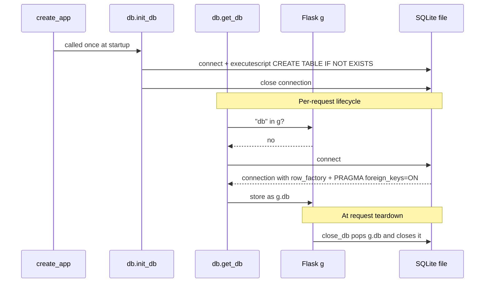
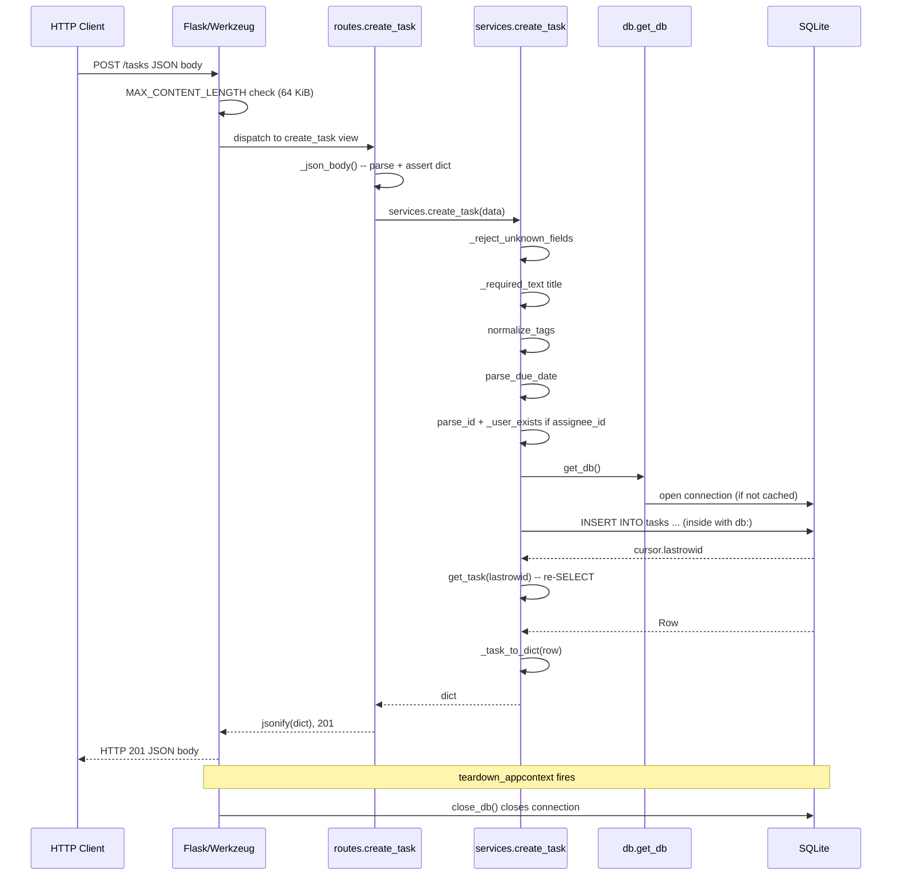
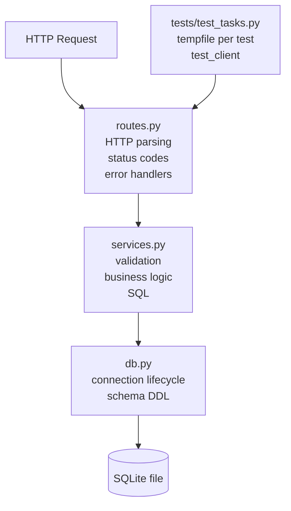

# Stage 2 - Plan mode: explore unfamiliar code

- Bob task (ACP session) id: `870e1654850d5883fafca581610d91ef`
- Bob: Bob 2.0.5 via `bob acp`
- Mode: `plan`
- Started (UTC): 2026-10-05T04:00:31+00:00 - duration 64.5 s - stop reason: end_turn
- Tool calls: 7; permission requests: 0 (denied: 0)

## Prompt (written by the Claude Code orchestrator)

```text
Treat this repository as unfamiliar code you are seeing for the first time. Explore it end to end and explain: the request lifecycle from HTTP request to database and back; how the application is created; how the database is initialized and when connections open and close; what the service layer and the route layer each own; how the tests set up and isolate their data; how a task is represented in SQLite versus in the JSON API; and which areas look most likely to hide correctness problems, with your reasoning. Do not modify any code.
```

## Tool calls by Bob

- `other` Using skill create-plan - completed
- `read` Reading file <repo>\app\__init__.py - completed
- `read` Reading file <repo>\app\db.py - completed
- `read` Reading file <repo>\app\services.py - completed
- `read` Reading file <repo>\app\routes.py - completed
- `read` Reading file <repo>\run.py - completed
- `read` Reading file <repo>\tests\test_tasks.py - completed

## Bob's answer (verbatim)

This is a read-only exploration and explanation task — no plan file or implementation needed. Let me read all the source files in depth before answering.I've read every line of the codebase. Here is the full, grounded walkthrough.

---

## 1. How the Application Is Created

[`create_app()`](app/__init__.py:10) is the only entry-point. It:

1. Creates a `Flask` instance with `instance_relative_config=True` so `instance/` is the default directory for the database file.
2. Sets two config keys: `DATABASE` (from the `TASKFLOW_DATABASE` env var or the `instance/` path) and `MAX_CONTENT_LENGTH` (64 KiB cap on request bodies).
3. Applies any `test_config` dict on top, which is how tests inject a temporary database path.
4. Turns off key-sorting in JSON responses (`sort_keys = False`) so field order is stable.
5. Creates the directory that will hold the database file (`os.makedirs(..., exist_ok=True)`).
6. Calls [`db.init_app()`](app/db.py:59) — runs the schema DDL and registers the connection-teardown hook.
7. Registers the custom `IdConverter` and the single Blueprint.

[`run.py`](run.py:7) calls `create_app()` without arguments (production/dev path) and starts the dev server; HOST and PORT are read from env vars.

---

## 2. Database Initialization and Connection Lifecycle



Key points:
- [`init_db()`](app/db.py:50) runs **at app-startup time**, not on first request. It uses its own short-lived connection (not `g`) and calls `executescript(SCHEMA)` which creates the `users` and `tasks` tables (both `CREATE TABLE IF NOT EXISTS`) and one index.
- [`get_db()`](app/db.py:36) lazily opens **one connection per application context** and caches it in Flask's `g` object. Every service-layer call within the same request shares that single connection.
- [`close_db()`](app/db.py:43) is registered via `app.teardown_appcontext` so it fires automatically at the end of every request (or after each test client request).
- The [`connect()`](app/db.py:28) helper sets `row_factory = sqlite3.Row` (columns accessible by name) and enables `PRAGMA foreign_keys = ON` on every connection it opens, including the schema-creation connection.

---

## 3. The Full Request Lifecycle

Using `POST /tasks` as the concrete example:



Error paths (any `ValidationError` or `NotFoundError`) are caught by Blueprint-level `@bp.app_errorhandler` handlers in [`routes.py`](app/routes.py:63), which format them as `{"error": "..."}` with the appropriate status code. Werkzeug HTTP exceptions (405, 413, etc.) get the same treatment via the third handler at line 73.

---

## 4. What the Service Layer Owns vs. the Route Layer

| Concern | [`routes.py`](app/routes.py) | [`services.py`](app/services.py) |
|---|---|---|
| Parse JSON body | `_json_body()` — asserts it is a `dict` | — |
| Parse query-string parameters | `request.args.get(...)` | `parse_id_param()` validates the extracted string |
| HTTP status codes | All status codes | None |
| `flask` / `request` / `jsonify` imports | Yes | None (zero Flask imports) |
| Validation of field values | — | All of it |
| Business rules (assignee existence, tag limits, date checks) | — | All of it |
| SQLite reads and writes | — | All of it via `get_db()` |
| Error-to-HTTP translation | `@bp.app_errorhandler` handlers | Raises `ValidationError` / `NotFoundError` |
| `date.today()` for overdue logic | Calls `date.today()` and passes it in | Receives `today` as a parameter |

This last point in the route layer is worth noting: `date.today()` is evaluated in [`routes.list_overdue_tasks()`](app/routes.py:50) and passed to `services.list_overdue_tasks(today)`. That keeps the service function pure (easy to test with an arbitrary date) without needing a clock-injection abstraction.

---

## 5. How a Task Is Represented: SQLite vs. JSON API

| Field | SQLite column type | SQLite value example | JSON API value |
|---|---|---|---|
| `id` | `INTEGER PRIMARY KEY AUTOINCREMENT` | `7` | `7` (integer) |
| `title` | `TEXT NOT NULL` | `"Write report"` | `"Write report"` |
| `description` | `TEXT NOT NULL DEFAULT ''` | `""` or text | `""` or text |
| `tags` | `TEXT NOT NULL DEFAULT ''` | `"backend,database"` | `["backend", "database"]` |
| `due_date` | `TEXT` (nullable) | `"2030-01-15"` or `NULL` | `"2030-01-15"` or `null` |
| `assignee_id` | `INTEGER` FK → `users.id` (nullable) | `3` or `NULL` | `3` or `null` |
| `completed` | `INTEGER` (nullable, no DEFAULT) | `NULL` or `1` | `false` or `true` |
| `created_at` | `TEXT NOT NULL` | `"2024-05-01T10:30:00+00:00"` | `"2024-05-01T10:30:00+00:00"` |

Three conversions happen in [`_task_to_dict()`](app/services.py:214):
- **tags**: split on comma (`"backend,database"` → `["backend", "database"]`); empty string → `[]`
- **completed**: `bool(row["completed"])` — `NULL` becomes `bool(None)` = `False`; `1` becomes `True`
- All other fields pass through as-is.

---

## 6. How Tests Set Up and Isolate Their Data

[`setUp()`](tests/test_tasks.py:10) in `TaskApiTestCase`:
1. `tempfile.mkstemp()` creates a **new, unique SQLite file** in the OS temp dir and immediately closes the OS file descriptor.
2. `create_app({"TESTING": True, "DATABASE": self.db_path})` constructs a fresh app instance pointing at that file. `init_db` runs inside `create_app`, creating a clean schema.
3. `self.client = self.app.test_client()` gives a Flask test client that runs requests in-process with no actual HTTP.

[`tearDown()`](tests/test_tasks.py:17): `os.remove(self.db_path)` deletes the file entirely.

There is no shared state between test cases — each gets its own SQLite file, and the file is deleted after the test finishes. Tests also use helper methods ([`create_user`](tests/test_tasks.py:19), [`create_task`](tests/test_tasks.py:24), [`overdue_ids`](tests/test_tasks.py:29)) that make HTTP calls through the test client and assert the expected status code inline, so a bad helper call causes an immediate, descriptive failure.

---

## 7. Areas Most Likely to Hide Correctness Problems

### a. `completed` column has no DEFAULT — `NULL` silently means `False`

In [`db.py`](app/db.py:19), the `completed` column is declared as `INTEGER` with **no DEFAULT** and no `NOT NULL`. New tasks are inserted without supplying `completed`, so SQLite stores `NULL`. The conversion `bool(None) == False` happens to produce the right result, but a query like `WHERE completed = 0` would **never match** a not-yet-completed task because `NULL != 0` in SQL. 

This is live today in [`list_overdue_tasks`](app/services.py:110): `WHERE due_date < ? AND completed = 0`. A newly created task with `completed IS NULL` will never satisfy `completed = 0`, meaning **the overdue endpoint will never return a task that has never been explicitly completed**. The correct SQL predicate is `completed IS NOT 1` or `(completed = 0 OR completed IS NULL)`. This is a silent correctness bug.

### b. `create_task` re-reads after INSERT with a second round-trip

[`create_task()`](app/services.py:67) calls `get_task(cursor.lastrowid)` after the insert. That is an extra `SELECT` inside the same transaction-free context. It works, but it means creation does two DB round-trips. Not a bug, but it could drift if `get_task` ever adds filters.

### c. `IdConverter` regex is not anchored against non-digit leading characters via Werkzeug's matching rules

[`IdConverter`](app/routes.py:15) sets `regex = r"[0-9]+"`. Werkzeug wraps converters' regexes inside a larger route regex, so in practice anchoring is handled by the route matching machinery. This is fine, but worth being aware of: the base `IntegerConverter` uses `r"\d+"` which on some Python builds includes Unicode decimal digits, while `[0-9]` is intentionally restricted to ASCII. This is the *intended* fix, not a bug.

### d. `parse_id_param` allows leading zeros

[`parse_id_param()`](app/services.py:171) checks `raw.isdigit()` and `raw.isascii()` but does not reject strings like `"007"`. `int("007")` == `7`, which is valid, so the query works — but a client sending `?assignee_id=007` and one sending `?assignee_id=7` will get identical results while looking semantically different. Minor ambiguity, not a correctness problem.

### e. Tags are stored and re-split by comma with no escaping

[`normalize_tags()`](app/services.py:116) validates each tag against `TAG_PATTERN = r"[a-z0-9][a-z0-9_-]{0,31}"` which forbids commas, so round-trip correctness is guaranteed. However, the tag format is implicit (just a comma-joined string column) — if the schema or validator ever changed to allow commas inside a tag value, splitting would silently break all existing rows.

### f. `complete_task` is not idempotent but behaves as if it is

[`complete_task()`](app/services.py:100) runs `UPDATE tasks SET completed = 1 WHERE id = ?` and checks `cursor.rowcount == 0` for not-found. If the task *exists* but is already completed, `rowcount` is still `1` (SQLite counts matched rows, not changed rows) — actually this is fine for the `rowcount` check. But the endpoint returns 200 for an already-completed task with no indication that no state change occurred. Depending on desired semantics (idempotent vs. transition-guarded), this might or might not be intended.

### g. `_optional_text` strips whitespace but returns `""` for `None` — whitespace-only strings become `""`

A client sending `{"description": "   "}` (whitespace only) will have it stripped to `""` and stored as empty, the same as omitting the field. This is consistent with `_required_text` behavior but could surprise callers who expect their whitespace to be preserved or rejected.

### h. The `overdue` endpoint's `completed` filter bug is not covered by tests

The test suite has `test_overdue_task_is_detected` and `test_future_task_not_listed_as_overdue`, but there is **no test that verifies a completed overdue task is excluded from the overdue list**. This means the `completed = 0` / `NULL` bug described in (a) goes undetected by the current test suite.

---

### Summary Diagram — Layer Boundaries



The most actionable finding is the `completed IS NULL` bug in `list_overdue_tasks` — new tasks are stored with `NULL` in `completed`, but the query filters for `completed = 0`, so the overdue list always returns empty unless tasks have been explicitly completed and then somehow reverted (which is not possible via the API). Every newly created task with a past due date will be silently excluded.
