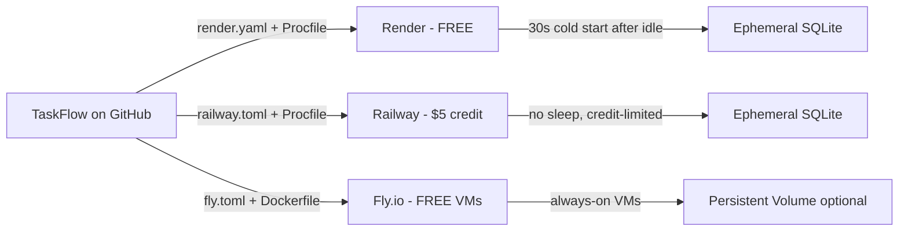

# Plan how to deploy TaskFlow as a small public demo on a free hosting tier, so judges can call the live API. Compare two or three free options that can run this Flask app, recommend one, and give the exact steps: production WSGI server, start command, port and host binding, where the SQLite file lives and what happens to it on restarts, environment variables, and any files the repository would need. Include a smoke test to run against the live URL and the main risks. Do not modify any files.

---

**Status:** active  **Date:** 2026-10-06

---

### 👤 User

Plan how to deploy TaskFlow as a small public demo on a free hosting tier, so judges can call the live API. Compare two or three free options that can run this Flask app, recommend one, and give the exact steps: production WSGI server, start command, port and host binding, where the SQLite file lives and what happens to it on restarts, environment variables, and any files the repository would need. Include a smoke test to run against the live URL and the main risks. Do not modify any files.

---

### 🤖 Assistant

> 🔧 called: use_skill

> 🔧 **use_skill** — create-plan

### 🤖 Assistant

> 🔧 called: spawn_subagent

Let me research the codebase to ground the plan in actual code before writing anything.

> 🔧 **spawn_subagent** — explore

### 🤖 Assistant

> 🔧 called: write_file

Excellent — I have everything I need. Let me now write the plan.

> 🔧 **write_file** — deploy-demo-plan.md

### 🤖 Assistant

Here's the full plan — no files are modified, only new deployment files will be created when you switch to implementation.

---

## Platform Comparison

**Recommendation: Render** — single `render.yaml` drives the entire deploy from git, zero Docker required, and `PORT` is already wired in `run.py`.

---

## What the plan covers

### Files to be created (no existing files touched)

| File | What it does |
|---|---|
| [`requirements.txt`](requirements.txt) | Appends `gunicorn==23.0.0` |
| `wsgi.py` | `app = create_app()` — Gunicorn entry point |
| `render.yaml` | Blueprint: build cmd, start cmd, env vars, free plan |
| `runtime.txt` | Pins `python-3.11.9` on Render's buildpack |
| `smoke_test.sh` | curl calls all 6 routes, prints PASS/FAIL |

### Key production wiring
- **Start command:** `gunicorn wsgi:app --bind 0.0.0.0:$PORT --workers 1 --timeout 120`
- **PORT:** Render injects it automatically; already read by `run.py` so it just works.
- **SQLite path:** `TASKFLOW_DATABASE=/opt/render/project/src/instance/taskflow.sqlite` — writable, directory auto-created by [`db.py`](app/db.py)'s `os.makedirs(..., exist_ok=True)`.
- **On restart/redeploy:** `init_db()` in [`app/db.py`](app/db.py) runs on every cold start and recreates tables — database starts empty but structurally ready.

### Main risks

| Risk | Mitigation |
|---|---|
| SQLite lost on every deploy | Document it; smoke test re-seeds data |
| 30-second cold start | Judges send a warm-up `GET /tasks` first |
| Port bound to 127.0.0.1 instead of 0.0.0.0 | Explicit `--bind 0.0.0.0:$PORT` in start command |
| Instance directory not writable | `TASKFLOW_DATABASE` points to known-writable path |

---

**Two questions before you approve:**

1. The plan sets `TASKFLOW_DATABASE` to `/opt/render/project/src/instance/taskflow.sqlite` — that path is specific to Render's container layout. Are you happy with that, or would you prefer a simpler path like `/tmp/taskflow.sqlite`?
2. The smoke test is written as a `bash` / `curl` script. Would you prefer a Python version instead (so it runs on Windows without WSL)?