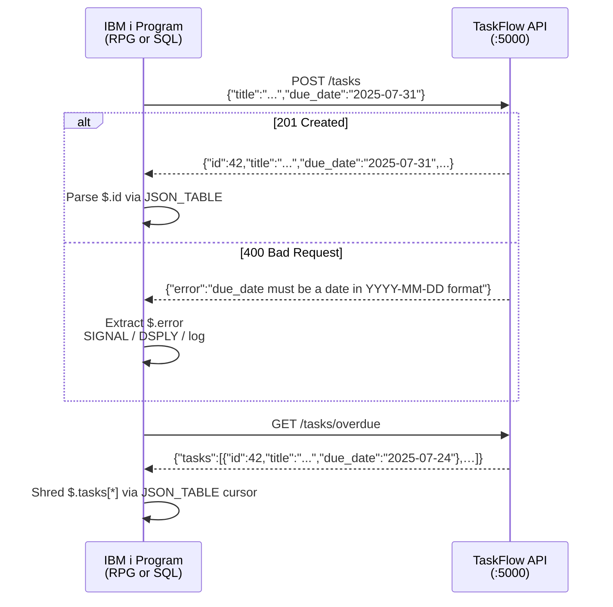

# An IBM i shop wants its existing jobs to use TaskFlow's REST API (see README.md for the endpoints). Show how an IBM i program could create a task with a due date and then list overdue tasks: give one short example using SQL HTTP functions (QSYS2.HTTP_POST / HTTP_GET with JSON_TABLE) and one using free-form RPG, and explain how each should handle a 400 error response from the API. Do not modify any files.

---

**Status:** active  **Date:** 2026-10-06

---

### 👤 User

An IBM i shop wants its existing jobs to use TaskFlow's REST API (see README.md for the endpoints). Show how an IBM i program could create a task with a due date and then list overdue tasks: give one short example using SQL HTTP functions (QSYS2.HTTP_POST / HTTP_GET with JSON_TABLE) and one using free-form RPG, and explain how each should handle a 400 error response from the API. Do not modify any files.

---

### 🤖 Assistant

> 🔧 called: read_file, read_file

I'll read the project documentation first, then provide well-grounded examples.

> 🔧 **read_file** — AGENTS.md

> 🔧 **read_file** — app/routes.py

### 🤖 Assistant

> 🔧 called: read_file

Now let me verify the exact shape of a task response and the overdue endpoint by checking the services layer:

> 🔧 **read_file** — app/services.py

### 🤖 Assistant

Now I have a precise picture of every request/response shape. Here are both examples.

---

## Calling TaskFlow from IBM i

The examples assume TaskFlow is reachable at `http://taskflow.example.com:5000`. Both examples are self-contained and do **not** modify any project files.

---

## Example 1 — SQL HTTP functions (`QSYS2.HTTP_POST` / `QSYS2.HTTP_GET` + `JSON_TABLE`)

```sql
-- ============================================================
-- Step 1: Create a task with a due date
--   POST /tasks
--   Body: {"title":"...", "due_date":"YYYY-MM-DD", "tags":["ibmi"]}
-- ============================================================
VALUES (
    QSYS2.HTTP_POST(
        'http://taskflow.example.com:5000/tasks',
        '{"title":"Process month-end close","due_date":"2025-07-31","tags":["ibmi","finance"]}',
        '{"header":"Content-Type","value":"application/json"}'
    )
) INTO :WS_RESPONSE_BODY;    -- host variable (VARCHAR 65535)

-- Inspect the HTTP status code separately.
-- HTTP_POST returns only the body; capture the last response code with:
VALUES QSYS2.HTTP_GET_HEADER('status_code') INTO :WS_STATUS;
-- If WS_STATUS = '400', the body is {"error":"..."} -- see error handling below.

-- Parse the created task id from the success response (HTTP 201):
SELECT TASK_ID
  INTO :WS_TASK_ID
  FROM JSON_TABLE(
         :WS_RESPONSE_BODY FORMAT JSON,
         '$'
         COLUMNS (
           TASK_ID    INTEGER PATH '$.id'
         )
       ) AS T;


-- ============================================================
-- Step 2: List overdue tasks
--   GET /tasks/overdue
--   Response: {"tasks":[{id, title, due_date, completed, ...}, ...]}
-- ============================================================
VALUES (
    QSYS2.HTTP_GET(
        'http://taskflow.example.com:5000/tasks/overdue',
        '{}'    -- no extra headers needed
    )
) INTO :WS_RESPONSE_BODY;

-- Shred the tasks array into rows:
SELECT TASK_ID, TASK_TITLE, DUE_DATE
  FROM JSON_TABLE(
         :WS_RESPONSE_BODY FORMAT JSON,
         '$.tasks[*]'
         COLUMNS (
           TASK_ID    INTEGER      PATH '$.id',
           TASK_TITLE VARCHAR(200) PATH '$.title',
           DUE_DATE   VARCHAR(10)  PATH '$.due_date'
         )
       ) AS T
 ORDER BY DUE_DATE, TASK_ID;


-- ============================================================
-- 400 Error handling
--   TaskFlow always returns {"error":"<message>"} on 400.
--   After any HTTP_POST / HTTP_GET call, check the status code
--   before consuming the body.
-- ============================================================
IF :WS_STATUS = '400' THEN
    SELECT ERROR_MSG
      INTO :WS_ERROR_MSG
      FROM JSON_TABLE(
             :WS_RESPONSE_BODY FORMAT JSON,
             '$'
             COLUMNS (
               ERROR_MSG VARCHAR(500) PATH '$.error'
             )
           ) AS E;
    -- Log, signal, or surface WS_ERROR_MSG to the caller.
    SIGNAL SQLSTATE '75001'
        SET MESSAGE_TEXT = :WS_ERROR_MSG;   -- raises a diagnosable exception
END IF;
```

### Key points for the SQL approach

| Point | Detail |
|---|---|
| **HTTP function** | `QSYS2.HTTP_POST` / `QSYS2.HTTP_GET` — available since IBM i 7.3 TR6 / 7.4 TR2 |
| **Status code** | Retrieve via `QSYS2.HTTP_GET_HEADER('status_code')` *after* the call; it reflects the last HTTP response |
| **Content-Type** | Must send `Content-Type: application/json`; TaskFlow rejects bodies it cannot parse as JSON with 400 |
| **Body size** | TaskFlow caps request bodies at 64 KiB — comfortably within normal task payloads |
| **400 body** | Always `{"error":"<readable message>"}` — extract with `JSON_TABLE('$.error')` |
| **`JSON_TABLE` path** | Use `'$.tasks[*]'` for array endpoints; `'$'` for single-object endpoints |

---

## Example 2 — Free-form ILE RPG (`QSYS2.HTTP_POST` via `EXEC SQL`)

```rpgle
**FREE
// =============================================================
// TASKFLOW -- IBM i ILE RPG caller
// Calls TaskFlow REST API to create a task and list overdue ones.
// Requires: IBM i 7.3 TR6+ (QSYS2.HTTP_POST / HTTP_GET)
// =============================================================
Ctl-Opt DftActGrp(*No) ActGrp(*Caller) Option(*SrcStmt);

// ---------------------------------------------------------------
// Constants
// ---------------------------------------------------------------
Dcl-C BASE_URL  'http://taskflow.example.com:5000';
Dcl-C HDR_JSON  '{"header":"Content-Type","value":"application/json"}';

// ---------------------------------------------------------------
// Working storage
// ---------------------------------------------------------------
Dcl-S wRespBody  Varchar(65535);
Dcl-S wStatus    Varchar(10);
Dcl-S wTaskId    Int(10);
Dcl-S wErrorMsg  Varchar(500);
Dcl-S wTitle     Varchar(200);
Dcl-S wDueDate   Varchar(10);
Dcl-S wPostBody  Varchar(1000);

// ---------------------------------------------------------------
// Step 1: Create a task  (POST /tasks)
// ---------------------------------------------------------------
wPostBody = '{"title":"Process month-end close",'
          + '"due_date":"2025-07-31",'
          + '"tags":["ibmi","finance"]}';

Exec Sql
  VALUES (QSYS2.HTTP_POST(
            :BASE_URL CONCAT '/tasks',
            :wPostBody,
            :HDR_JSON))
  INTO :wRespBody;

If SqlCode <> 0;
  // SQL error (network timeout, driver fault) -- surface to caller
  dsply ('SQL error on POST: ' + %Char(SqlCode));
  *InLR = *On;
  Return;
EndIf;

// Retrieve the HTTP status code
Exec Sql
  VALUES (QSYS2.HTTP_GET_HEADER('status_code'))
  INTO :wStatus;

// ---------------------------------------------------------------
// Handle 400 -- extract {"error":"..."} message
// ---------------------------------------------------------------
If wStatus = '400';
  Exec Sql
    SELECT ERROR_MSG
      INTO :wErrorMsg
      FROM JSON_TABLE(
             :wRespBody FORMAT JSON, '$'
             COLUMNS (ERROR_MSG VARCHAR(500) PATH '$.error')
           ) AS E;
  dsply ('TaskFlow 400: ' + %TrimR(wErrorMsg));
  *InLR = *On;
  Return;
EndIf;

// ---------------------------------------------------------------
// Parse the new task id from the 201 response body
// ---------------------------------------------------------------
Exec Sql
  SELECT TASK_ID
    INTO :wTaskId
    FROM JSON_TABLE(
           :wRespBody FORMAT JSON, '$'
           COLUMNS (TASK_ID INTEGER PATH '$.id')
         ) AS T;

dsply ('Created task id: ' + %Char(wTaskId));

// ---------------------------------------------------------------
// Step 2: List overdue tasks  (GET /tasks/overdue)
// ---------------------------------------------------------------
Exec Sql
  VALUES (QSYS2.HTTP_GET(
            :BASE_URL CONCAT '/tasks/overdue',
            '{}'))
  INTO :wRespBody;

If SqlCode <> 0;
  dsply ('SQL error on GET overdue: ' + %Char(SqlCode));
  *InLR = *On;
  Return;
EndIf;

Exec Sql
  VALUES (QSYS2.HTTP_GET_HEADER('status_code'))
  INTO :wStatus;

// GET /tasks/overdue only fails with 400 if the route is hit
// incorrectly (e.g. a bad query-string parameter); handle it
// the same way as the POST case.
If wStatus = '400';
  Exec Sql
    SELECT ERROR_MSG
      INTO :wErrorMsg
      FROM JSON_TABLE(
             :wRespBody FORMAT JSON, '$'
             COLUMNS (ERROR_MSG VARCHAR(500) PATH '$.error')
           ) AS E;
  dsply ('TaskFlow 400 on overdue: ' + %TrimR(wErrorMsg));
  *InLR = *On;
  Return;
EndIf;

// ---------------------------------------------------------------
// Cursor over the tasks array
// ---------------------------------------------------------------
Dcl-S wOverdueId  Int(10);

Exec Sql
  DECLARE C_OVERDUE CURSOR FOR
    SELECT TASK_ID, TASK_TITLE, DUE_DATE
      FROM JSON_TABLE(
             :wRespBody FORMAT JSON,
             '$.tasks[*]'
             COLUMNS (
               TASK_ID    INTEGER      PATH '$.id',
               TASK_TITLE VARCHAR(200) PATH '$.title',
               DUE_DATE   VARCHAR(10)  PATH '$.due_date'
             )
           ) AS T
     ORDER BY DUE_DATE, TASK_ID;

Exec Sql OPEN C_OVERDUE;

Dow SqlCode = 0;
  Exec Sql
    FETCH NEXT FROM C_OVERDUE
    INTO :wOverdueId, :wTitle, :wDueDate;

  If SqlCode <> 0;
    Leave;
  EndIf;

  dsply (%Char(wOverdueId) + ' ' + %TrimR(wDueDate) + ' ' + %TrimR(wTitle));
EndDo;

Exec Sql CLOSE C_OVERDUE;

*InLR = *On;
Return;
```

---

## How each approach handles a 400 response

TaskFlow **always** returns `{"error": "<human-readable message>"}` for every 400. The two cases that cause 400 on `POST /tasks` are:

| Cause | Example error message |
|---|---|
| Missing or blank `title` | `"title is required and must be a non-empty string"` |
| Unknown JSON field | `"unknown field(s): prioritiy"` (typo) |
| Bad `due_date` format | `"due_date must be a date in YYYY-MM-DD format"` |
| Non-existent `assignee_id` | `"assignee_id does not match an existing user"` |

### SQL approach
After `HTTP_POST`, call `QSYS2.HTTP_GET_HEADER('status_code')`. If it equals `'400'`, shred the body with `JSON_TABLE('$.error')` and `SIGNAL SQLSTATE '75001'` to raise a diagnosable SQL condition the calling program can catch with a condition handler.

### RPG approach
After every `EXEC SQL ... HTTP_POST/HTTP_GET`, check `SqlCode` first (a non-zero code means the HTTP call itself failed at the SQL driver level). Then read the HTTP status with `HTTP_GET_HEADER` into a `VARCHAR(10)` host variable. If `wStatus = '400'`, use an inline `JSON_TABLE` `SELECT INTO` to extract `$.error` into `wErrorMsg`, log it (or set a return code), and branch out. The `DSPLY` opcode is used here for brevity — in production code you would write the message to a message queue with `QMHSNDPM` or return it to the caller via a data structure parameter.

### Architecture diagram

