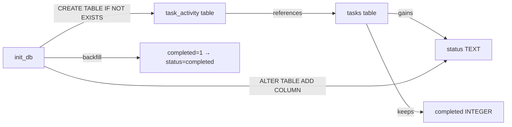
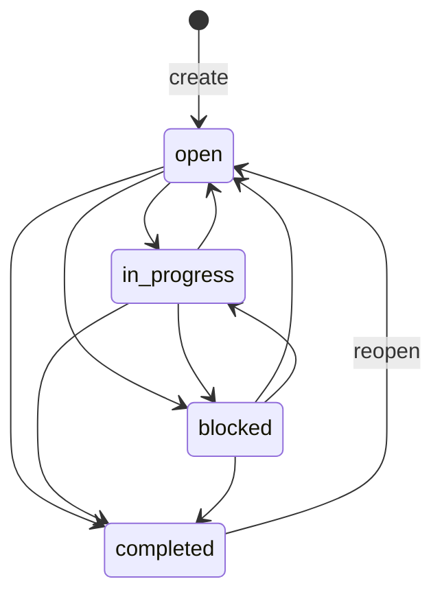

# TaskFlow tasks only have a boolean completed flag, which limits it as a team task board. Plan a focused evolution of the domain model: a task lifecycle (for example open, in progress, blocked, completed) and an immutable activity history that records every meaningful change to a task (created, status changed, reassigned, due date changed, tags or details edited, completed or reopened) with what changed and when, shown as a timeline in the task detail view of the web UI.

Constraints: no destructive migration; databases created by older versions of TaskFlow must keep working and be upgraded safely on startup; existing clients that use the completed field and POST /tasks/<id>/complete must keep working; the verified overdue and tag-filter behavior must stay correct; invalid status transitions must be rejected explicitly; activity records must reflect changes that actually happened, not mere attempts. Do not turn TaskFlow into a large project-management suite.

Before planning, inspect the schema, the existing upgrade path for old databases, the API, the UI and the tests. Use subagents to assess migration risk, API compatibility and test strategy. Then write the plan to docs/plans/lifecycle-and-activity-plan.md: data model, migration path, API changes, UI changes, tests (including tests against databases created with the previous schema), milestones, and how each milestone will be verified. Do not modify code yet.

---

**Status:** active  **Date:** 2026-10-06

---

### 👤 User

TaskFlow tasks only have a boolean completed flag, which limits it as a team task board. Plan a focused evolution of the domain model: a task lifecycle (for example open, in progress, blocked, completed) and an immutable activity history that records every meaningful change to a task (created, status changed, reassigned, due date changed, tags or details edited, completed or reopened) with what changed and when, shown as a timeline in the task detail view of the web UI.

Constraints: no destructive migration; databases created by older versions of TaskFlow must keep working and be upgraded safely on startup; existing clients that use the completed field and POST /tasks/<id>/complete must keep working; the verified overdue and tag-filter behavior must stay correct; invalid status transitions must be rejected explicitly; activity records must reflect changes that actually happened, not mere attempts. Do not turn TaskFlow into a large project-management suite.

Before planning, inspect the schema, the existing upgrade path for old databases, the API, the UI and the tests. Use subagents to assess migration risk, API compatibility and test strategy. Then write the plan to docs/plans/lifecycle-and-activity-plan.md: data model, migration path, API changes, UI changes, tests (including tests against databases created with the previous schema), milestones, and how each milestone will be verified. Do not modify code yet.

---

### 🤖 Assistant

> 🔧 called: use_skill

> 🔧 **use_skill** — create-plan

### 🤖 Assistant

> 🔧 called: update_todo_list

Requirements are clear from the detailed prompt. Let me now spawn subagents to research the codebase in parallel — schema/migration, API/compatibility, and UI/tests.

> 🔧 **update_todo_list** — [-] Spawn subagents to inspect schema, migration path, API, UI, and tests
[ ] Review subagent findings and confirm design intent
[ ] Write plan to docs/plans/lifecycle-and-activity-plan.md
[ ] Validate plan with user

### 🤖 Assistant

> 🔧 called: spawn_subagent, spawn_subagent, spawn_subagent

> 🔧 **spawn_subagent** — explore

> 🔧 **spawn_subagent** — explore

> 🔧 **spawn_subagent** — explore

### 🤖 Assistant

> 🔧 called: update_todo_list

Excellent — thorough findings from all three subagents. Let me now synthesize everything and write the plan.

> 🔧 **update_todo_list** — [x] Spawn subagents to inspect schema, migration path, API, UI, and tests
[-] Write plan to docs/plans/lifecycle-and-activity-plan.md
[ ] Validate plan with user

### 🤖 Assistant

> 🔧 called: read_file, read_file

Let me read a few targeted spots to confirm details before writing:

> 🔧 **read_file** — app/services.py

> 🔧 **read_file** — app/db.py

### 🤖 Assistant

> 🔧 called: read_file, read_file

> 🔧 **read_file** — app/services.py

> 🔧 **read_file** — app/services.py

### 🤖 Assistant

> 🔧 called: read_file

> 🔧 **read_file** — app/services.py

### 🤖 Assistant

> 🔧 called: read_file

> 🔧 **read_file** — app/services.py

### 🤖 Assistant

> 🔧 called: list_files

Now I have a complete picture. Let me write the plan:

> 🔧 **list_files** — docs

### 🤖 Assistant

> 🔧 called: write_file

> 🔧 **write_file** — docs/plans/lifecycle-and-activity-plan.md

### 🤖 Assistant

> 🔧 called: update_todo_list

> 🔧 **update_todo_list** — [x] Spawn subagents to inspect schema, migration path, API, UI, and tests
[x] Write plan to docs/plans/lifecycle-and-activity-plan.md
[-] Validate plan with user

### 🤖 Assistant

> 🔧 called: ask_followup_question

The plan is written to [`docs/plans/lifecycle-and-activity-plan.md`](docs/plans/lifecycle-and-activity-plan.md). Here is a summary of every key decision for your review:

---

## Architecture at a glance

### Valid transition graph

---

## Key decisions made — please confirm or push back on any

**1. `completed` column is kept and kept in sync.** Every write that changes `status` also writes `completed` (1 or 0). Old clients, old tests, and the `OldSchemaRegressionTestCase` all continue to pass with zero changes.

**2. Migration uses `ALTER TABLE ADD COLUMN` guarded by `OperationalError` catch** — the same idempotent pattern already in `init_db`. No `schema_version` table; not warranted for this project's scale.

**3. No activity backfill for pre-existing tasks** — tasks created before the upgrade will show an empty timeline. The UI simply renders nothing.

**4. `POST /tasks/<id>/complete` is kept and kept idempotent** — it internally sets `status = 'completed'`; calling it on an already-completed task succeeds silently (existing behaviour preserved).

**5. `status` is also added to the PATCH whitelist.** `PATCH {"status": "in_progress"}` is the ergonomic way for the UI to drive transitions. `completed` remains forbidden in PATCH.

**6. `GET /tasks/stats` `open` key retains its current meaning** (non-completed count) so no existing reader breaks, while `in_progress` and `blocked` are added as new keys.

**7. Activity is a separate `GET /tasks/<id>/activity` endpoint**, not embedded in the task object, to avoid inflating every list response.

**8. Invalid transitions return `400`** (consistent with all other `ValidationError` paths), not `409`.

**9. Five milestones**, each independently verifiable: db → services → routes → UI → regression sweep.

---

A few questions before we hand off to implementation:

 

### 🤖 Assistant

Decision 8 above: invalid status transitions return 400 Bad Request (consistent with all other ValidationError responses). Would you prefer 409 Conflict instead, or is 400 fine?

> 🔧 **ask_followup_question** — Decision 8 above: invalid status transitions return 400 Bad Request (consistent with all other ValidationError responses). Would you prefer 409 Conflict instead, or is 400 fine?

---

### 👤 User

Use 409 Conflict for transitions that are not allowed from the task's current state, and keep 400 for malformed input such as an unknown status value. The other decisions are fine, with one concern about decision 2: catching OperationalError around ALTER TABLE could also hide unrelated database errors, so make the "column already exists" check explicit. Update the plan file accordingly.

---

### 🤖 Assistant

> 🔧 called: read_file

Good feedback on both counts. Let me update the plan with those two precise changes.

> 🔧 **read_file** — docs/plans/lifecycle-and-activity-plan.md

### 🤖 Assistant

> 🔧 called: read_file

> 🔧 **read_file** — docs/plans/lifecycle-and-activity-plan.md

### 🤖 Assistant

> 🔧 called: read_file

> 🔧 **read_file** — docs/plans/lifecycle-and-activity-plan.md

### 🤖 Assistant

> 🔧 called: apply_diff

Three targeted edits needed:
1. Constraint 5 — clarify 409 vs 400 split
2. Migration strategy step 2 — replace OperationalError catch with explicit column existence check
3. `StatusLifecycleTestCase` bullet — fix "invalid transition → 400" to "→ 409"
4. Milestone 3 — fix the 409/400 paragraph
5. `PATCH /tasks/<id>` — fix "invalid transition → 400" to "→ 409"

> 🔧 **apply_diff** — docs/plans/lifecycle-and-activity-plan.md

### 🤖 Assistant

The plan is updated. Here is a precise summary of every change made:

---

### Changes applied to [`docs/plans/lifecycle-and-activity-plan.md`](docs/plans/lifecycle-and-activity-plan.md)

**1. Constraint 5 (line 34)** — Split the single ambiguous sentence into two explicit rules:
- Valid-but-disallowed transitions → `409 Conflict`
- Malformed input (unknown status value) → `400 Bad Request`

**2. Migration strategy step 2 (line 101)** — Replaced "catch `OperationalError`" with the explicit approach:
> Query `PRAGMA table_info(tasks)` first and only issue the `ALTER TABLE` when `status` is absent. This avoids catching a broad `OperationalError` that could silently mask unrelated database errors.

**3. `PATCH /tasks/<id>` validation bullet (line 153)** — The transition-validity bullet now explicitly says `409 Conflict` with the exact error message shape.

**4. `StatusLifecycleTestCase` test bullets (line 287)** — Replaced the single "every invalid transition returns 400" bullet with two distinct bullets — one for `409` (disallowed transition) and one for `400` (unknown status value), with concrete examples for each.

**5. Milestone 3 (line 374)** — The 409/400 paragraph now describes a `TransitionError` exception class that the service layer raises for disallowed transitions, which the route layer maps to `409`. `ValidationError` continues to map to `400` for everything else. This makes the boundary clean and the error-handling path explicit.